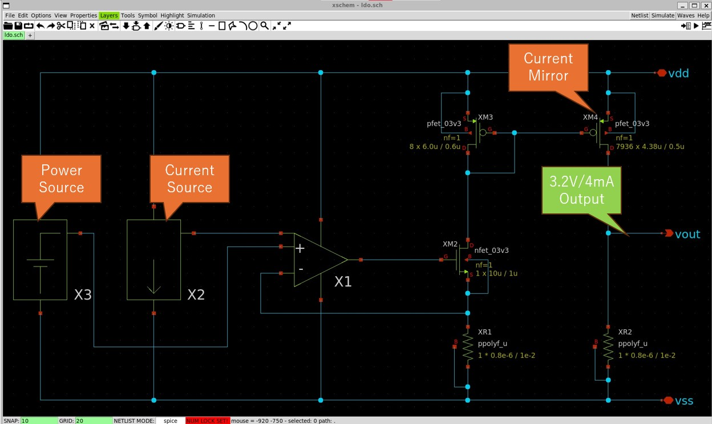

# LDO for ADC of Chipathon2023's Japan Team

  
  

## Specification
    - Process
        - Global Fundories 180nm
    - Size
        - 700um x 550um
    - In Voltage (VDD)
        - 3.3V
    - Out Voltage (Vout)
        - 3.2V
    - Out Ampere (Vout)
        - 4mA

## Other Parts
- [Power Source (Band Gap Reference)](https://github.com/atuchiya/DC23-LTC2/tree/japan-test/BGR)
    - Made by Akira Tsuchiya at Chipathon2023's Japan Team
- [Current Source](https://github.com/keropiyo/Chipathon2023)
    - Made by Miho Yamada at Chipathon2023's Japan Team
- [Waffle Type P-Fet Array (as Current Mirror)](https://github.com/akiles-esta-usado/DC23-LTC2/tree/add-ic-makefile/LDO/xschem/waffle_1984)
    - Made by Akiles Esta Usado at Chipathon2023's Chili Team

# License

