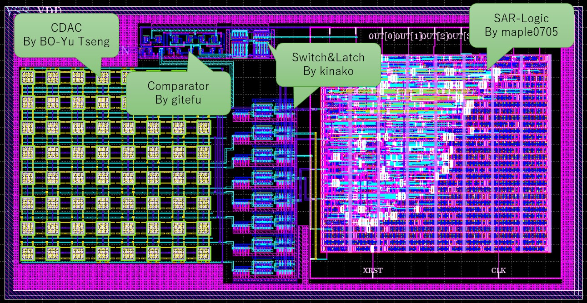
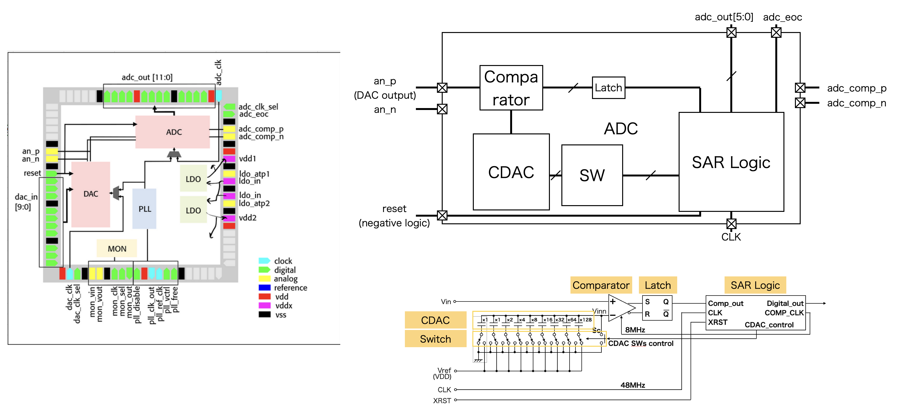
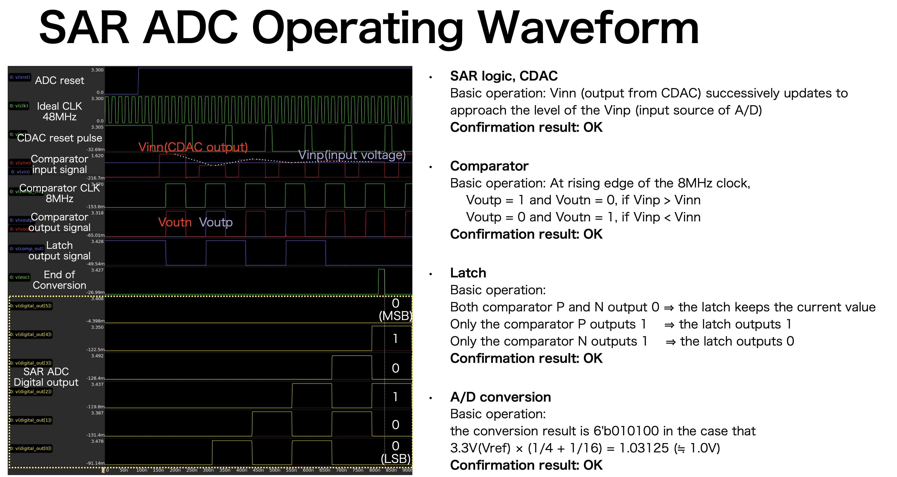
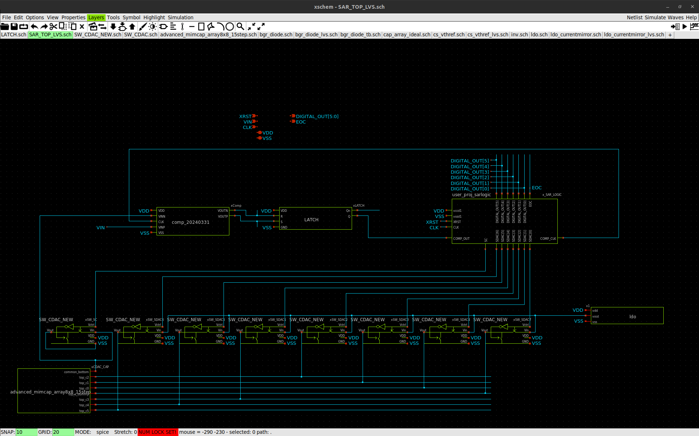
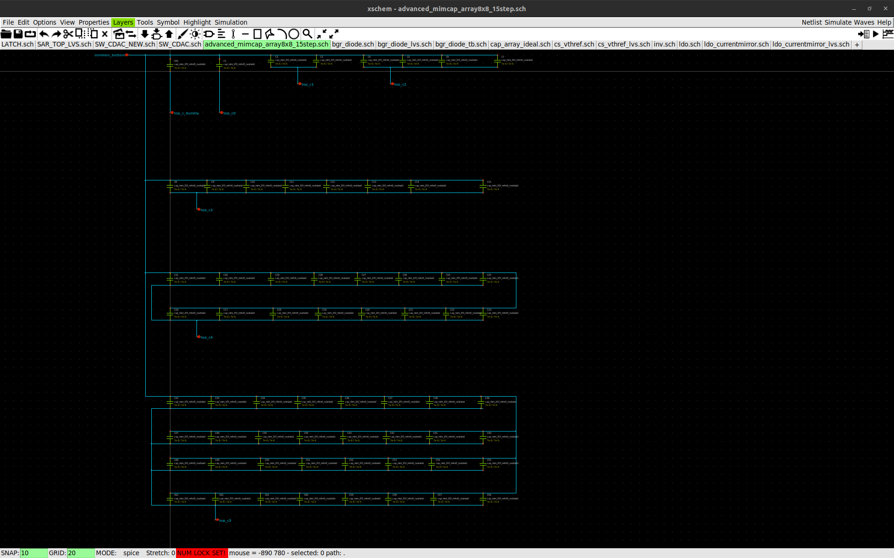
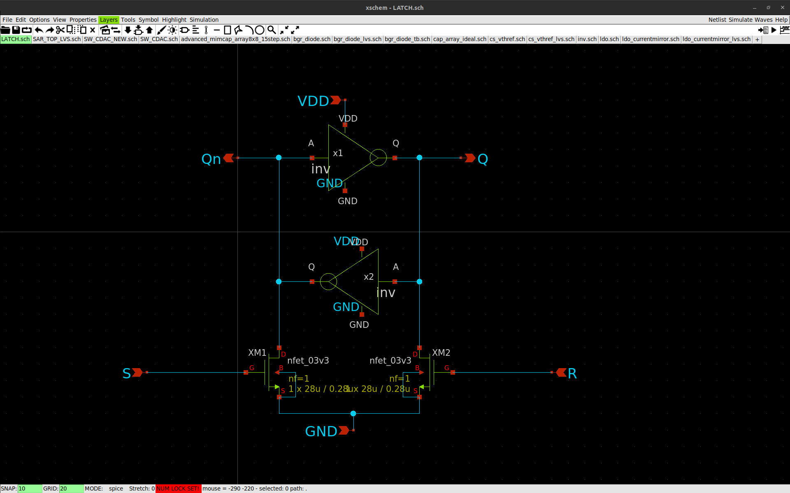
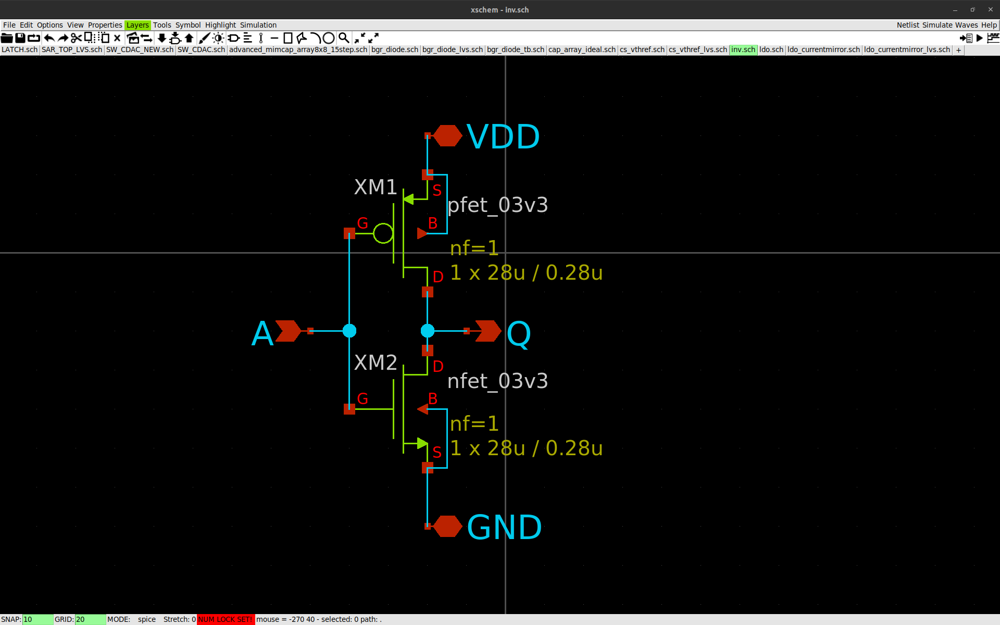
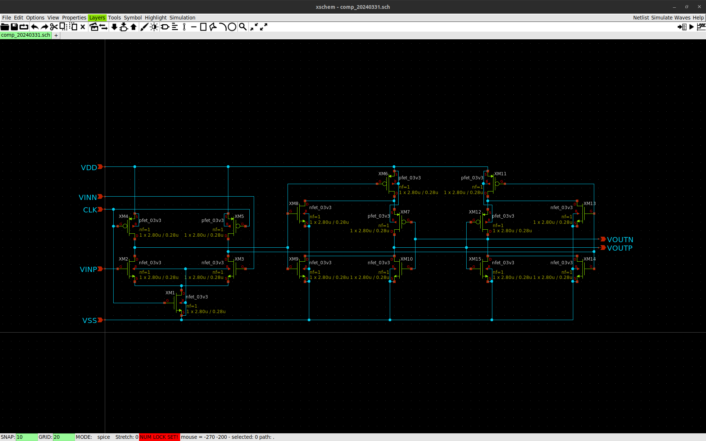
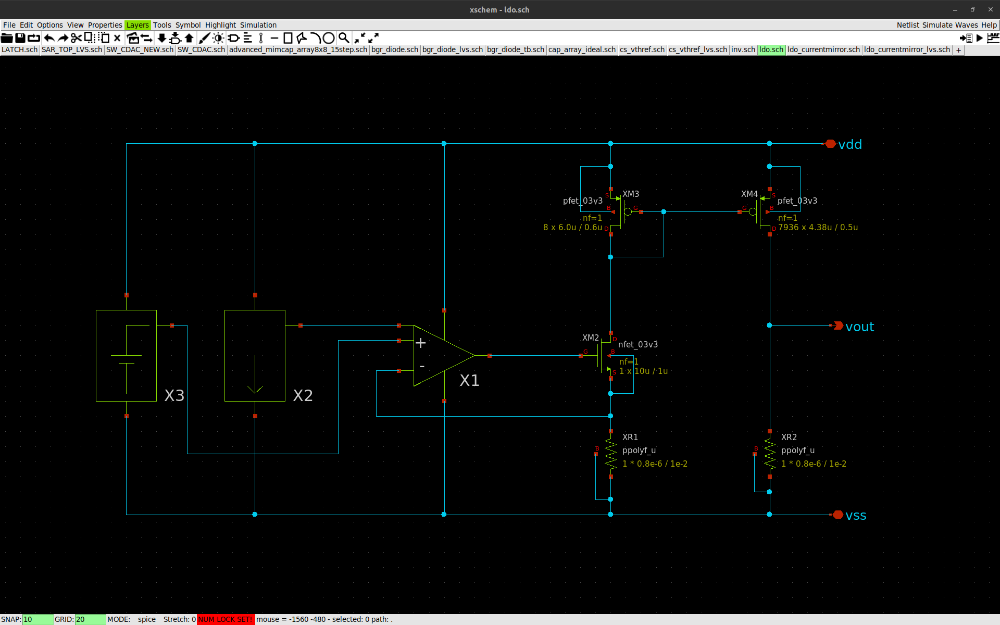

# Submission files
- [GDSII for tapeout](https://github.com/ishi-kai/Chipathon2023_ADC/blob/main/submit_version/klayout/SAR_TOP.gds)
- [Schematic file for LVS](https://github.com/ishi-kai/Chipathon2023_ADC/blob/main/submit_version/xschem/sar_adc_lvs.sch)

    
    
    

# Descriptoin of each desgin file
| File | Purpose/Function | Remark |
| --- | --- | --- |
|SW_CDAC.sch|switch component for each CDAC bit which is based the https://github.com/ishi-kai/Chipathon2023_ADC/blob/main/transmission-gate/sw.sch|The only difference from the base sw.sch is the NMOS connected to the Vout port|
|SW_CDAC.sym|symbol file made from the Sw_CDAC.sch||
|user_proj_sarlogic.sym|symbol file used for the simulatin of [user_proj_sarlogic_pex_extracted.spice](https://github.com/ishi-kai/Chipathon2023_ADC/blob/main/maple0705/SAR%20Logic/caravel/openlane/user_proj_sarlogic_pex_extracted.spice)||
|user_proj_sarlogic.sch|blackbox module for making the symbol file of user_proj_sarlogic||
|tran_sar_logic.sch|schematic file for the unit-level verification of SAR logic||
|tran_sar_adc.sch|Testbench for the integration of the overalll SAR A/D converter as shown in the figure below||

 

## Miscellaneous:  
  - Top-level schematic of the A/D converter with the corresponding PEX extraction of SAR logic (*.spice file)  
    - https://github.com/ishi-kai/Chipathon2023_ADC/blob/main/maple0705/SAR%20Logic/caravel/openlane/user_proj_sarlogic_pex_extracted.spice    -   
  - Design of the MIM capacitor array  
    - https://github.com/ishi-kai/Chipathon2023_ADC/tree/cdac_tseng/cdac/mim_cap_array_8x8
    -   
  - Design of the latch component
    - https://github.com/ishi-kai/Chipathon2023_ADC/tree/main/latch  
    - https://github.com/ishi-kai/Chipathon2023_ADC/tree/main/inverter
    -   
    -   
  - Design of the comparator
    - https://github.com/ishi-kai/Chipathon2023_ADC/tree/main/gitefu/comp_20240331
    -   
  - Unused/Tentative design material
      - LDO: https://github.com/ishi-kai/Chipathon2023_ADC/tree/main/noritsuna/ldo
      -   
